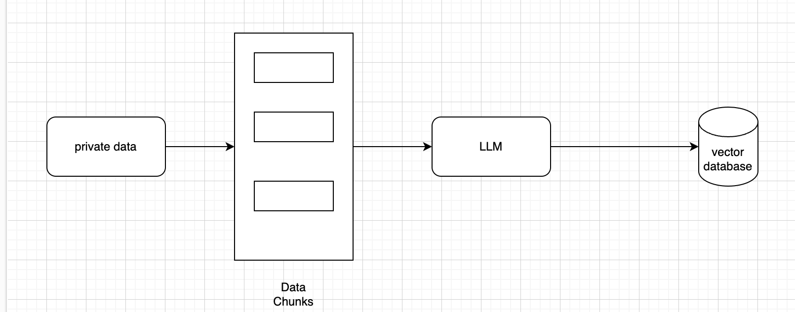

## Queries on Vector database

* what are the difficulties with LLM?

Difficulty with LLM is that they only know about what they learned during training.

* How do we get LLM to use private data?

The typical way to do this to convert all private data into embeddings then storing in the vector database.

* What is the process of storing the data in vector database?

- chunk the data into small pieces
- Pass that data through LLM 
- The data can then be stored in database of the vector representation used to recover that piece of data.

* How the flow of question and answering works?

A question which we ask can be converted into an embedding which is the query.
we can then search for pieces of data located close to it in the embedding space and feed relevant documents to the LLM for it to extract an answer from.

