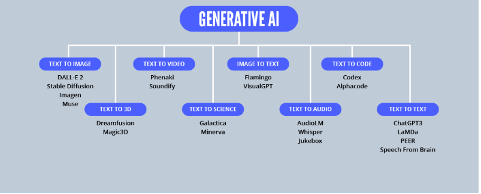

# What is generative AI?

Generative AI is a type of artificial intelligence that helps create different types of content, including images, videos, audio, and data.

# How Generative AI Will Reshape the Internet?

Search Experiences 
Public Access to Content-Rich Platforms
Global Information Exchange
The Vision of the Internet
The Future of Software Development

# What is NLP
Natural Language Processing (NLP) is a subfield of Artificial Intelligence (AI).Machines use NLP techniques to understand, analyze, and manipulate human language. As machines become more intuitive about human communication, data processing becomes more efficient. NLP coaching can help machines understand nuances of language such as the following: 

* Sentiments

* Tone

* Opinions

# Top 5 NLP Applications

* Email Filtering
* Voice Assistants
* Search Engine Autocomplete
* Chatbots
* Text Analytics

